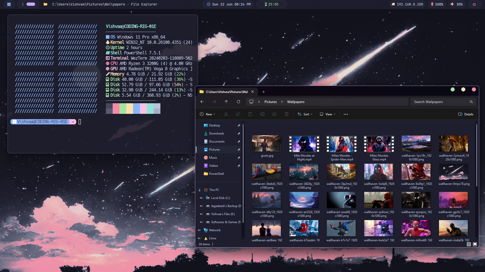

<h1 align="center">Aesthetic Windows Setup</h1>

<p align="center">
   
</p>

<div align="center">
<p>
<a href="https://github.com/vishvaa-vsk/windots/"></a>&nbsp;&nbsp;
<a href="https://github.com/vishvaa-vsk/windots/commits/master/"></a>&nbsp;&nbsp;
<a href="https://github.com/vishvaa-vsk/windots/blob/master/LICENSE"></a>&nbsp;&nbsp;
</p>
</div>

<br>

<br/><br/>
<br/><br/>
<br/><br/>
<br/><br/>
<br/>

<hr>

## 🌷 About

Hi there! 👋

Welcome to **windots** — a curated set of dotfiles designed to deliver a visually appealing, Unix-inspired workflow on Windows.

This project is focused on refining and optimizing the Windows experience, making it more streamlined and reminiscent of Unix systems. From tiling window managers to terminal enhancements and workflow tweaks, everything here is crafted to make Windows more efficient and enjoyable.

## ✨ Features

- 🪟 **Glazewm** configuration
- ❄️ Elegant **YASB** setup
- 🌸 Streamlined **VSCode** environment
- \>_ Modern **WezTerm** configuration
- 🐚 **Powershell** customization
- 🎨 **Ohmyposh** theming
- ⚙️ Lightweight **fastfetch** setup
- 🚀 **Flow launcher** with **Catppuccin** styling
- 🐈 [**Catppuccin**](https://github.com/catppuccin) theme integration throughout

<hr/>

## 🌸 Core System Info

- **OS:** [Windows 11](https://www.microsoft.com/en-in/windows/windows-11) 🪟 + [WSL2](https://learn.microsoft.com/en-us/windows/wsl/) 🐧
- **WM:** [GlazeWM](https://github.com/glzr-io/glazewm) ✨
- **Shell:** [powershell](https://learn.microsoft.com/en-us/powershell/) / [zsh](https://zsh.sourceforge.io/) 🐚
- **Terminal Emulator:** [WezTerm](https://wezfurlong.org/wezterm/) >_
- **Panel:** [YASB](https://github.com/amnweb/yasb) ❄️
- **Text Editor:** [VSCode](https://code.visualstudio.com/)
- **App Launcher:** [Flow launcher](https://www.flowlauncher.com/) 🚀
- **File Manager:** [File explorer](https://www.microsoft.com/en-us/windows/tips/file-explorer)
- **Browser:** [Brave Browser](https://brave.com) 🌐
- **Colorscheme:** [Catppuccin](https://catppuccin.com/) 🎨

<hr/>

### ℹ️ Full System Details

Below is a comprehensive overview of my setup:

> [!NOTE]
> Some applications have their **configuration files** included in this repository, indicated by ⚙️.

#### 🪟 System

|  Name                  |  App                                                                                                                                    |
| ------------------------ | ---------------------------------------------------------------------------------------------------------------------------------------- |
| **OS**                   | [Windows 11](https://www.microsoft.com/en-in/windows/windows-11) + [WSL2](https://learn.microsoft.com/en-us/windows/wsl/)                |
| **Window Manager**       | [GlazeWM](https://github.com/glzr-io/glazewm) [⚙️](https://github.com/vishvaa-vsk/windots/blob/master/.config/glazewm/config.yaml)     |
| **Bar**                  | [YASB](https://github.com/amnweb/yasb) [⚙️](https://github.com/vishvaa-vsk/windots/blob/master/.config/yasb/)                          |
| **Application Launcher** | [Flow Launcher](https://www.flowlauncher.com/) [⚙️](https://github.com/catppuccin/flow-launcher/blob/main/themes/Catppuccin%20Mocha.xaml) |

#### 🖥️ CLI/TUI Applications

|  Name                  |  App                                                                                                                                                                                                                                                                                                        |
| ------------------------ | ---------------------------------------------------------------------------------------------------------------------------------------------------------------------------------------------------------------------------------------------------------------------------------------------------------------------------------------------------- |
| **Shell**                | [zsh](https://zsh.sourceforge.io/)  / [pwsh](https://learn.microsoft.com/en-us/powershell/module/microsoft.powershell.core/about/about_pwsh?view=powershell-7.4) [⚙️](https://github.com/vishvaa-vsk/windots/blob/master/.config/WindowsPowershell/Microsoft.PowerShell_profile.ps1) |
| **Terminal Emulator**    | [WezTerm](https://wezfurlong.org/wezterm/) [⚙️](https://github.com/vishvaa-vsk/windots/blob/master/.config/wezterm/wezterm.lua)                                                                                                                                                                                                                         |
| **Shell Prompt**         | [ohmyposh](https://ohmyposh.dev/) [⚙️](https://github.com/JanDeDobbeleer/oh-my-posh/blob/master/themes/catppuccin.omp.json)                                                                                                                                                                                                                              |
| **Text Editor**          | [VSCode](https://code.visualstudio.com/)                                                                                                                                                                                                                                          |
| **LS Replacement**       | [eza](https://github.com/eza-community/eza)                                                                                                                                                                                                                                                                                                          |
| **Cat Replacement**      | [bat](https://github.com/sharkdp/bat) [⚙️](https://github.com/vishvaa-vsk/dotfiles/tree/master/.config/bat) |
| **System Fetch**         | [fastfetch](https://github.com/fastfetch-cli/fastfetch) [⚙️](https://github.com/vishvaa-vsk/dotfiles/blob/master/.config/fastfetch/config.jsonc) |


#### 🖱️ GUI Applications

|  Name                  |  App                                                                                                                                                                                                                            |
| ------------------------ | -------------------------------------------------------------------------------------------------------------------------------------------------------------------------------------------------------------------------------- |
| **Fallback Text Editor** | [VSCode](https://code.visualstudio.com/)                                                                                                   |
| **Music Player**         | [Spotify](https://open.spotify.com/) (customized with [Spicetify](https://spicetify.app/))                                                                                                                                        |
| **Web Browser**          | [Brave Browser](https://brave.com) with [Catppuccin Mocha](https://chromewebstore.google.com/detail/catppuccin-chrome-theme-m/cmpdlhmnmjhihmcfnigoememnffkimlk) theme|
| **File Manager**         | [File Explorer](https://www.microsoft.com/en-us/windows/tips/file-explorer)                                                                                          |

#### 🔍 Miscellaneous

|  Name              |  App                                                         |
| -------------------- | ------------------------------------------------------------- |
| **Colorscheme**      | [Catppuccin Mocha](https://catppuccin.com)                  |
| **Font**             | [JetBrainsMono Nerd Font](https://www.jetbrains.com/lp/mono/) |
<hr>

## 🔧 Setup

> [!WARNING]
> Please **backup your current configuration files** before proceeding.  
> Some settings may overwrite your existing setup, so ensure you merge or restore as needed.

### 🪟 GlazeWM

> [!NOTE]  
> This configuration is compatible with the latest **GlazeWM** release and uses **YASB** instead of Zebar.

- **Download and install** [**GlazeWM**](https://github.com/glzr-io/glazewm/releases/).

- Copy [`windots/.config/glazewm/config.yaml`](.config/glazewm/config.yaml) to `%USERPROFILE%\.glzr\glazewm\config.yaml`

- **Restart GlazeWM** to apply the configuration.

### 📊 YASB (Yet Another Status Bar)

> [!NOTE]
> For proper icon display, use a Nerd Font. I recommend **JetBrainsMono Nerd Font**; if you use another, update the font in YASB's `styles.css`.

- **Download and install** [**YASB**](https://github.com/amnweb/yasb/releases/).

- Copy [`windots/.config/yasb/`](.config/yasb/) to `%USERPROFILE%\.config\yasb\`

- **Restart YASB** to load the new configuration.

### 🌐 Browser

> [!NOTE]
> This setup utilizes **Brave Browser** with the **Catppuccin Mocha** theme extension.

- **Install** [**Brave Browser**](https://brave.com/)

- **Add the Catppuccin Mocha theme extension**:
   - [Catppuccin Chrome Theme - Mocha](https://chromewebstore.google.com/detail/catppuccin-chrome-theme-m/bkkmolkhemgaeaeggcmfbghljjjoofoh)

- **Optional:** Set [startpage](https://chromewebstore.google.com/detail/bonjourr-%C2%B7-minimalist-sta/dlnejlppicbjfcfcedcflplfjajinajd) as your homepage for a clean look.

### 🚀 Flow Launcher

- **Install** [**Flow Launcher**](https://www.flowlauncher.com/)

- Copy [`windots/.config/FlowLauncher/settings.json`](.config/FlowLauncher/settings.json) to `%APPDATA%\FlowLauncher\Settings\Settings.json`

- **Restart Flow Launcher** to apply changes.

## \>_ Terminal & Shell Setup

### 🖥️ WezTerm

- **Install** [**WezTerm**](https://wezfurlong.org/wezterm/)

- Copy [`windots/.config/wezterm/wezterm.lua`](.config/wezterm/wezterm.lua) to `%USERPROFILE%\.config\wezterm\wezterm.lua`

- **Restart WezTerm** to activate the configuration.

### 🐚 PowerShell

- Copy [`windots/.config/WindowsPowershell/Microsoft.PowerShell_profile.ps1`](.config/WindowsPowershell/Microsoft.PowerShell_profile.ps1) to `%USERPROFILE%\Documents\WindowsPowerShell\Microsoft.PowerShell_profile.ps1`

- Restart PowerShell to load the new profile.

### 🎨 Oh My Posh

- **Install** [**Oh My Posh**](https://ohmyposh.dev/docs/installation/windows) via winget:

```bash
winget install JanDeDobbeleer.OhMyPosh -s winget
```

- Copy [`windots/.config/ohmyposh/zen.toml`](.config/ohmyposh/zen.toml) to `%USERPROFILE%\.config\ohmyposh\zen.toml`

- **Optional:** If you use my PowerShell profile, you don't need to set the theme manually. The following command is already included and runs at PowerShell startup:

```bash
oh-my-posh init pwsh --config "$env:USERPROFILE\.config\ohmyposh\zen.toml" | Invoke-Expression
```

### ⚙️ Fastfetch

- **Install** [**fastfetch**](https://github.com/fastfetch-cli/fastfetch) using **winget**:

```bash
winget install fastfetch
```

- Copy [`windots/.config/fastfetch/config.jsonc`](.config/fastfetch/config.jsonc) to `%USERPROFILE%\.config\fastfetch\config.conf`
- Copy [`windots/.config/fastfetch/windows.txt`](.config/fastfetch/windows.txt) to `%USERPROFILE%\.config\fastfetch\windows.txt`

- **Run fastfetch** to view system info.

## 📌 Todo

- [ ] Create an **install script** for easier configuration setup.
- [ ] Add **detailed README files** in each config directory with usage instructions.

## 🎉 Credits

A huge thank you to the communities of **r/unixporn**, **r/desktops**, **GlazeWM**, **YASB**, **Komorebi**, **Catppuccin**, and many others for their inspiration and contributions!

Special mentions for resources and projects that were instrumental in this setup:

- [**ashish0kumar**](https://github.com/ashish0kumar/windots) for the initial inspiration and some of the configurations used in this project 🌟
- [**orxngc**](https://github.com/orxngc/walls-catppuccin-mocha) for the stunning **catppuccin-themed wallpapers** 🖼️
- [**GlazeWM**](https://github.com/glzr-io/glazewm) for an outstanding **tiling window manager** that boosts productivity ✨
- [**YASB**](https://github.com/amnweb/yasb) for a **versatile and customizable status bar** 🚀
- [**Catppuccin**](https://catppuccin.com) for providing the **best color palette** 🖌️

<br>

Thank you! 💖

<hr>

<p align="center">
   
</p>
